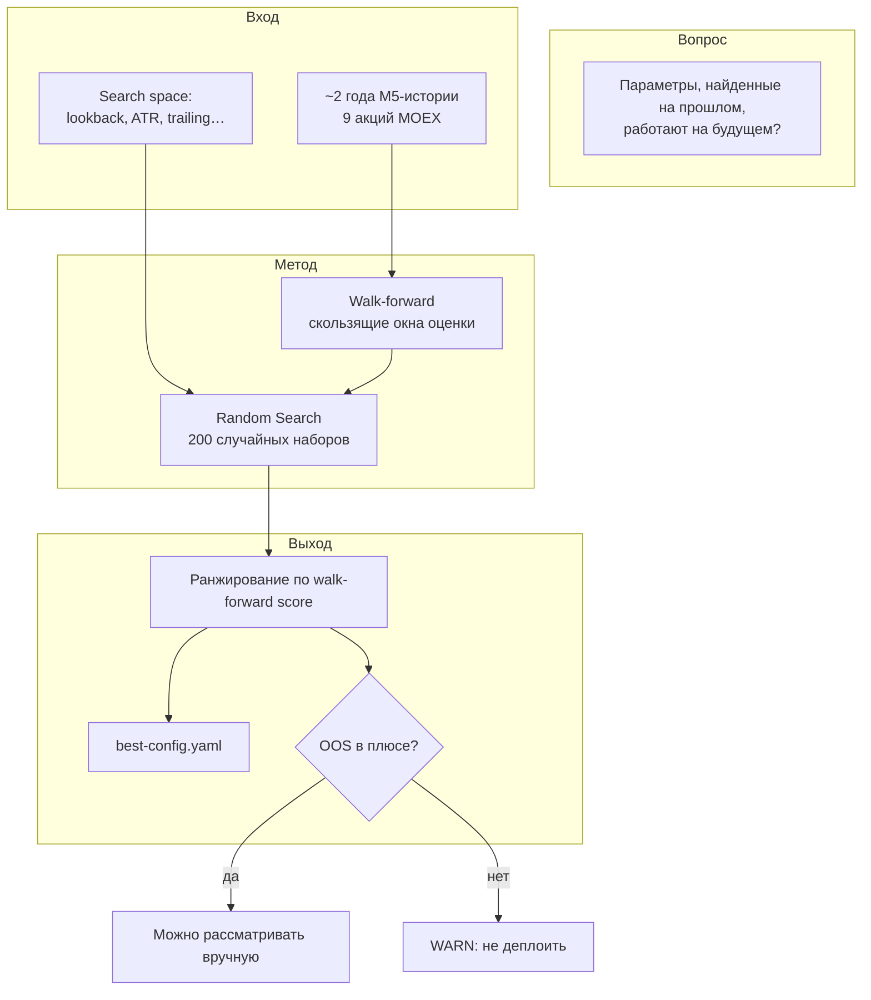
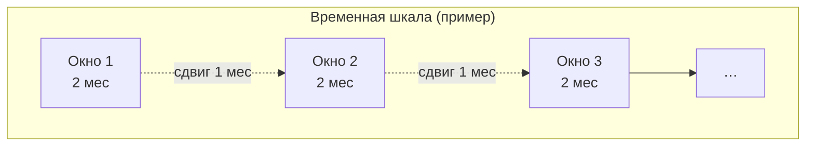
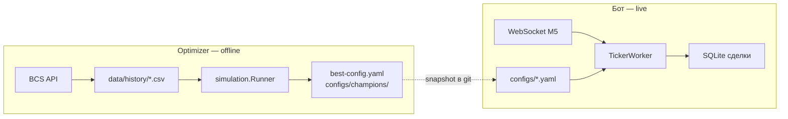
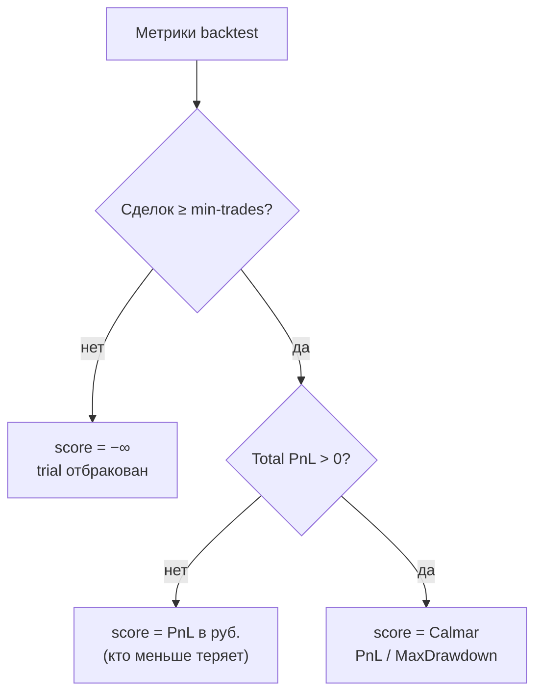
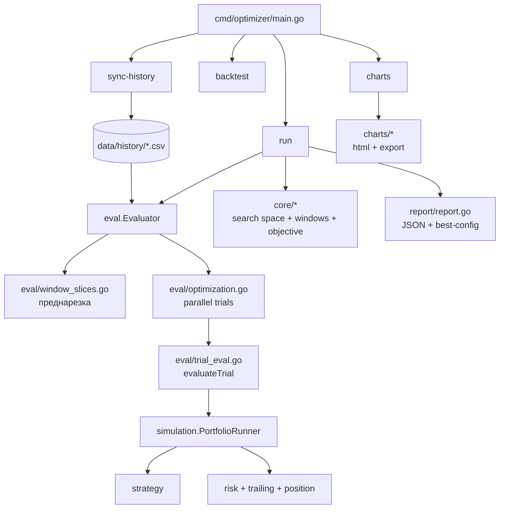

# bcs-strategy-optimizer

Offline-подбор гиперпараметров торговых стратегий: walk-forward backtest + Random Search.

> **Статус исследований (2026-07-11):** portfolio **FROZEN** — 3 champion-стратегии (ORC, OR Fade, MF Afternoon).  
> Не запускать optimizer по champions без явного запроса.  
> Главный документ: [`docs/strategy-research.md`](../../docs/strategy-research.md).

Отдельный бинарник — не трогает `cmd/bot`, но использует **тот же код стратегий и тот же торговый цикл** (`internal/simulation` ≈ `engine.TickerWorker`).

## Содержание

- [Подход](#подход)
- [Как интерпретировать результат](#как-интерпретировать-результат)
- [Быстрый старт](#быстрый-старт)
- [Команды и флаги](#команды-и-флаги)
- [Конфигурация](#конфигурация)
- [Scoring и комиссия](#scoring-и-комиссия)
- [Производительность](#производительность)
- [Архитектура (для разработчиков)](#архитектура-для-разработчиков)
- [Стратегии: как добавить и подключить](../../docs/strategies.md)
- [Результаты экспериментов](experiment-summary-prompt.md)

---

## Подход

### Какой вопрос мы задаём

Optimizer отвечает не на «какой максимальный PnL на всей истории», а на:

> **Если подобрать параметры на прошлом и торговать на следующем куске времени — будет ли это хоть сколько-нибудь устойчиво?**



### Walk-forward — почему не один backtest на всём периоде

Один прогон на 2024–2026 легко **переобучить**: параметры запомнят конкретные движения. Walk-forward режет историю на скользящие окна и проверяет устойчивость на многих независимых кусках.



| Параметр | Роль |
|----------|------|
| **window-months** (2) | Длина каждого окна оценки |
| **step-months** (1) | Шаг сдвига → много независимых проверок за 2 года |

**Итоговый score trial** = **медиана** score по всем окнам (устойчивость важнее одного удачного квартала).

### Random Search — что ищем

Из YAML search space случайно выбирается 200 комбинаций параметров (`-trials`, `-seed`). Grid search на 10+ измерениях взорвался бы; Bayesian/TPE — возможное расширение (интерфейс `Searcher` уже есть).

**Внутри одного прогона не перебираются** (отдельные запуски CLI):

- `stop_mode` — `atr` vs `range` (`-stop-mode`)
- universe — 3 vs 9 тикеров (`-tickers`)
- тип стратегии (`-strategy` + свой search space)

### Optimizer и бот



| | Optimizer | Бот |
|---|-----------|-----|
| Данные | CSV-история | Live свечи |
| Цель | «Стоит ли эта гипотеза?» | «Торгуем по конфигу» |
| Параметры | Тысячи trials | Один YAML на эксперимент |
| Исполнение | `VirtualExecutor` в памяти | virtual / real |

### Scoring — как выбираем «лучший» trial



Комиссия вычитается в optimizer вручную — иначе поиск завышал бы частые сделки.

### Двухфазный режим (опционально)

Ускорение, **не** улучшение метода: фаза 1 — random search на 3 lean-тикерах; фаза 2 — top-20 пересчитываются на всех 9. Включение: `-two-phase`.

---

## Как интерпретировать результат

### Если walk-forward убыточен (как в текущих прогонах)

Лог: `WARN optimizer: walk-forward убыточен`. Это значит:

- optimizer **отработал штатно** — нашёл наименее плохой trial;
- **не** «сломался» и **не** обязательно переобучение (edge в данных не виден);
- **не** доказательство, что прибыль невозможна в принципе — только что **в этом search space, на этом периоде и universe устойчивого плюса нет**.

| Следует | Не следует |
|---------|------------|
| Не деплоить `best-config` | Думать, что «ещё 500 trials найдут плюс» |
| Менять **гипотезу** (логику стратегии), а не только цифры | Ждать чуда от live vs backtest |
| Разобрать убыток по тикерам/окнам | Считать optimizer бесполезным |

### Если walk-forward в плюсе

`best-config.yaml` — **предложение**, не автодеплой. Проверить вручную: стабильность по окнам, число сделок, поведение на отдельных тикерах, затем paper → real.

---

## Быстрый старт

```bash
export BCS_REFRESH_TOKEN=...   # только для sync-history

make build-optimizer
make sync-history

# FROZEN champions — только по явному запросу:
# make optimizer-orc
# make optimizer-or-fade
# make optimizer-afternoon

make optimizer-run        # alias: sync + ORC walk-forward
make strategy-matrix      # legacy: 4 стратегии, ~1–2 ч
```

Champion snapshots для бота: `configs/champions/*.yaml`. Paper portfolio: `configs/runs/portfolio-paper.yaml`.

Стратегии и search space:

| `-strategy` | Search space | Статус |
|-------------|--------------|--------|
| `opening_range_continuation` | `configs/strategies/orc.yaml` | **FROZEN** champion |
| `opening_range_fade` | `configs/strategies/or-fade.yaml` | **FROZEN** champion |
| `momentum_filtered` | `configs/strategies/momentum-filtered-afternoon-wave2-narrow.yaml` | **FROZEN** champion |
| `momentum_breakout` | `configs/strategies/momentum-breakout.yaml` | legacy |
| `opening_range` | `configs/strategies/opening-range.yaml` | legacy |
| `mean_reversion` | `configs/strategies/mean-reversion.yaml` | legacy |

Полный гайд: [docs/strategies.md](../../docs/strategies.md).

---

## Команды и флаги

### Makefile

| Target | Описание |
|--------|----------|
| `make sync-history` | Догрузка CSV |
| `make optimizer-run` | sync + оптимизация |
| `make strategy-matrix` | 4 стратегии подряд (`scripts/run-strategy-matrix.sh`) |

| Переменная | Default | Назначение |
|------------|---------|------------|
| `OPTIMIZER_PARALLEL` | `0` | Trials параллельно (`0` = все ядра) |
| `OPTIMIZER_TWO_PHASE` | — | `1` — двухфазный поиск |
| `SEARCH_SPACE` | `search-space.yaml` | YAML для `optimizer-run` |

### `optimizer run` — основные флаги

| Флаг | Default | Описание |
|------|---------|----------|
| `-strategy` | `momentum_breakout` | ID стратегии |
| `-trials` | `200` | Random search trials |
| `-window-months` / `-step-months` | 2 / 1 | Walk-forward окна |
| `-min-trades` | `20` | Мин. сделок для валидного score |
| `-stop-mode` | `atr` | `atr` или `range` |
| `-parallel` | `0` | Параллельные trials |
| `-two-phase` | `false` | Lean → full universe |
| `-phase2-top` | `20` | Top-N для фазы 2 |
| `-output` | `results/` | JSON + YAML + `charts/` |

После завершения оптимизации автоматически генерируются HTML-графики сделок в `{output}/charts/` и пакет для ИИ-анализа в `{output}/export/`.

### `optimizer charts` — графики сделок и экспорт для ИИ

Графики и экспорт создаются автоматически после `optimizer run`. Подкоманду можно вызвать отдельно для перегенерации:

```bash
optimizer charts -experiment mean_reversion
# → results/exp-mean_reversion/charts/SBER.html, GAZP.html, …
# → results/exp-mean_reversion/export/data-summary.json, data-trades.json, prompt-*.md

optimizer charts -all
# → графики по всем exp-* в results/ (где есть best-config-*.yaml)
```

Свечи + маркеры входа/выхода + панель сделок. Открыть в браузере (нужен интернет для CDN Lightweight Charts).

**Экспорт для ИИ** — тот же формат, что в веб-админке (`/export`):
- `data-summary.json` + `prompt-summary.md` — агрегаты без списка сделок
- `data-trades.json` + `prompt-detailed.md` — полный список сделок

PnL в optimizer-экспорте — **net** (комиссия вычтена). В JSON также `optimizer.walk_forward_score` и `optimizer.total_window_pnl` из последнего `optimizer-run-*.json`.

| Флаг | Default | Описание |
|------|---------|----------|
| `-experiment` | — | `momentum_breakout` или `exp-momentum_breakout` |
| `-all` | `false` | все эксперименты в `results-dir` (взаимоисключающе с `-experiment`) |
| `-results-dir` | `results` | корень результатов |
| `-history-dir` | `data/history` | CSV свечей |

Полный список: `optimizer run -h`.

### Другие подкоманды

```bash
optimizer sync-history          # инкрементальная догрузка CSV
optimizer backtest ...          # один прогон без оптимизации
optimizer charts -experiment momentum_breakout   # графики сделок по тикерам
optimizer fetch-history ...     # полная перезагрузка (legacy)
```

---

## Конфигурация

### `configs/shared/tickers.yaml`

```yaml
lean_tickers: [SBER, ROSN, NVTK]   # для -two-phase
tickers: [SBER, GAZP, ...]         # полный universe
```

### Search space

Параметры с `min`/`max` — в random search. Секция `fixed` — риск, EOD (не ищутся).

---

## Scoring и комиссия

- Score = **median** по окнам → **ранжирование trials**
- `VirtualExecutor` не вычитает комиссию из `GrossPnL`; optimizer вычитает `-commission_per_lot × quantity`
- По умолчанию: **0.10 ₽/акцию** (TQBR), **5.0 ₽/контракт** (SPBFUT) — из `tickers.yaml` / `costs.commission_per_lot` или `-commission-per-lot`
- `AggregateTrades` сортирует сделки всех тикеров по `ClosedAt` перед MaxDrawdown/Calmar

---

## Производительность

Объём: `trials × окна × тикеры` backtest'ов (~вдвое меньше, чем при train+test).

| Оптимизация | Что делает |
|-------------|------------|
| `PrecomputeWindowSlices` | Свечи по окнам нарезаются один раз |
| `-parallel 0` | Trials на всех ядрах CPU |
| `trialContext` | trailCfg и params — один раз на trial |

Двухфазный режим: ~3× быстрее фаза 1 (3 тикера), фаза 2 — только top-N без random search.

---

## Архитектура (для разработчиков)



### Модули `internal/optimizer/`

| Модуль | Назначение |
|--------|------------|
| `core/*` | Search space, random search, метрики/score, walk-forward окна |
| `eval/*` | `Evaluator`, trial execution, backtest, parallel optimization |
| `report/*` | JSON-отчёт, `best-config`, печать top-N |
| `charts/*` | HTML-графики, export для ИИ-анализа |
| `data/*` | `tickers.yaml`, fetch/throttle-конфиг, утилиты свечей |
| `two_phase.go` | Lean → full |
| `history.go`, `fetch.go` | CSV и BCS API |

### Ключевые типы

```go
type TrialResult struct {
    Params ParameterSet
    Score  float64   // median по окнам — ранжирование
    Windows []WindowResult
}
```

### Design decisions

- **No auto-deploy** — `best-config` применяется вручную
- **`stop_mode` / universe** — вне search space, отдельные CLI-запуски
- **`Searcher`** — задел под TPE/Bayesian (`internal/optimizer/core/search.go`)

### Известные исправления (старые прогоны)

- **`rangeUseCap`** у `momentum_breakout` был инвертирован — перезапустить `-stop-mode range`
- **Equity curve** — сортировка по `ClosedAt` across тикеров (влияет на Calmar при прибыли)
- **`score > 0` ≠ прибыль в деньгах** — `Score` это медиана `Calmar` по окнам,
  нечувствительна к паре сильно убыточных окон. Воспроизведено на реальных данных:
  `mean_reversion/atr` дал `score=+0.6854`, а суммарный PnL по окнам = **−42 134 руб**.
  `RunOptimizationWithConfig` явно предупреждает и в этом случае — **всегда сверяйте
  `score` с суммой PnL по окнам в JSON**, одного знака `score` недостаточно.

---

## Учёт комиссии

`VirtualExecutor` и `ClosedTrade.GrossPnL` **не вычитают** комиссию. Optimizer вычитает `-commission_per_lot × quantity` при расчёте `Metrics.TotalPnL`.

Defaults: **0.10 ₽** round-trip за акцию (TQBR), **5.0 ₽** за контракт (SPBFUT). Задаётся в `costs.commission_per_lot` (`tickers.yaml` / `best-config`) или флагом `-commission-per-lot`. Трейлинг-стоп использует то же значение для offset безубытка.

## Выходные файлы

- `results/optimizer-run-{timestamp}.json` — все trials + метрики по окнам
- `results/best-config-{timestamp}.yaml` — лучшая конфигурация в формате `internal/config`
- stdout: top-5 по walk-forward score

## Design decision: no auto-deploy

Optimizer **только предлагает** конфиг. Применение вручную: скопировать в `configs/champions/` или `configs/runs/`, затем запустить бота.

## Известные баги (исправлены)

**`rangeUseCap` был инвертирован для `momentum_breakout` (fixed после первого прогона).**
`momentumBreakoutOptsFromParams` считал `RangeUseCap: !paramsBoolDefault(...)` — с
отрицанием, в отличие от `mean_reversion`/`opening_range`, где та же функция
вызывается без `!`. Из-за этого при `stop_mode=range` (и как fallback у `atr`,
если ATR не считается) стоп всегда ставился без капа — `0.5 × range` вместо
`~0.5% от цены`, т.е. в разы шире, чем задумано и чем в runtime-боте
(`internal/config.StrategyOptions`/`BuildStrategy`, где `rangeUseCap` по
умолчанию `true`). Это напрямую бьёт не только по optimizer: тот же
`momentumBreakoutOptsFromParams` — единственный путь построения стратегии в
`cmd/bot` (`internal/engine/worker.go` → `StrategyConfig.BuildStrategy` →
`strategy.NewFromParams`). Баг был внесён в этом же коммите (до него —
`if s.opts.RangeUseCap { ... }` без инверсии). Сейчас все продовые конфиги
(`configs/*.yaml`) используют `stop_mode: atr`, так что live-бот на практике
не пострадал, но при переключении на `range` получил бы кратно расширенные
стопы. См. регрессионный тест
`TestMomentumBreakoutFromParamsDefaultsRangeUseCapTrue`.

Это, вероятно, основная причина катастрофического результата эксперимента
"range stop" (−430k из выжимки) — с капом в разы шире реального стопа
кардинально меняет R-дистанцию, размер позиции и достижимость тейк-профита.
**Рекомендация: перезапустить `stop_mode=range` эксперименты и
`strategy-matrix` после этого фикса** — прежние range-результаты не отражают
задуманную стратегию.

**Equity curve по портфелю считалась в неверном порядке (fixed).**
`EvaluatePeriod` прогоняла тикеры последовательно и складывала их сделки в
`netPnLs` в порядке "все сделки тикера A, затем все сделки тикера B, …", а не
в реальном хронологическом порядке закрытия позиций. `ComputeMetrics` строит
equity curve и считает `MaxDrawdown`/`Calmar` по порядку элементов среза —
т.е. просадка считалась по искусственной, не соответствующей реальности
последовательности. Пока все прогоны убыточны, `Score` использует `TotalPnL`
напрямую (сумма не зависит от порядка), поэтому ранжирование trials это не
искажало — но как только появится прибыльная конфигурация, сравнение по
`Calmar` будет опираться на бессмысленный `MaxDrawdown`. Исправлено:
`AggregateTrades` сортирует сделки по `ClosedAt` перед агрегацией по всем
тикерам. См. тест `TestAggregateTradesSortsAcrossTickersByTime`.

**`score > 0` не означает прибыльность конфигурации в деньгах (fixed — предупреждение добавлено).**
`Score` — медиана `Calmar` по всем walk-forward окнам. У части окон может
быть неплохой `Calmar` (мало сделок, маленькая просадка), при этом сумма
`TotalPnL` по всем окнам всё равно отрицательна — медиана нечувствительна к
паре сильно убыточных окон. На реальных данных (см. ниже) воспроизведено:
`mean_reversion`/`atr`, `best score=0.6854` (положительный!), при этом
суммарный PnL по всем окнам = **−42134 руб**. Раньше `RunOptimization`
предупреждал об убыточности только при `Score < 0`, то есть в этом случае
предупреждения не было бы вообще — конфигурация выглядела бы прибыльной.
Добавлена дополнительная проверка суммарного `TotalPnL` по окнам с явным
предупреждением. **Вывод: при выборе конфигурации из top-N всегда проверяйте
не только `score`, но и сумму PnL по окнам в JSON/выводе.**

## Результаты первого честного прогона на реальных данных (исторический архив)

> **Примечание:** ниже — результаты **раннего** matrix-прогона (2024–2026), до нахождения champions ORC / OR Fade / MF Afternoon.  
> Актуальный portfolio: [`docs/strategy-research.md`](../../docs/strategy-research.md).

> Исторические прогоны ниже использовали старую схему train/test (6m/2m/1m).
> Текущая версия — скользящие окна оценки (`-window-months` / `-step-months`).

MOEX M5, 9 акций (`configs/shared/tickers.yaml`), 2024-07-03 → 2026-07-03,
17 walk-forward окон (6m/2m/1m). Best score / суммарный PnL по всем окнам:

| strategy            | stop_mode | trials | best test_score | total test PnL, руб |
|---------------------|-----------|--------|------------------|----------------------|
| momentum_breakout    | atr       | 200    | −24658           | −234 641             |
| momentum_breakout    | range     | 200    | −64601           | −605 950             |
| momentum_filtered    | atr       | 80     | −5484            | −155 472             |
| momentum_filtered    | range     | 80     | −58356           | −1 053 068           |
| opening_range        | atr       | 80     | −23362           | −145 002             |
| opening_range        | range     | 60     | −82042           | −916 718             |
| mean_reversion       | atr       | 60     | −64.85           | −71 085              |
| mean_reversion       | atr       | 200    | +0.6854          | **−42 134** (см. предупреждение выше) |
| mean_reversion       | range     | 60     | −33135           | −310 667             |

**Ни одна конфигурация на полном universe не прибыльна OOS в деньгах.**
`mean_reversion`+`atr` стабильно ближе всех к безубытку — это ожидаемо
согласуется с фиксом `rangeUseCap` (устранил искусственно раздутые убытки
`stop_mode=range`) и с тем, что момент-стратегии на M5 голубых фишках MOEX
конкурируют с HFT/маркет-мейкерами.

Отдельно прогнан `mean_reversion`/`atr` по каждому тикеру индивидуально
(100 trials, `-min-trades 10`): только **MGNT** дал положительный суммарный
test PnL (+5315 руб за 2 года, best test_score=2.36); остальные 8 тикеров —
убыток. **Это не считается найденной альфой**: +5315 руб за 2 года при
депозите 200k — статистически незначимая величина, и выбор "лучшего из 9
тикеров постфактум" — classic multiple comparisons problem (при 9 независимых
попытках шанс случайно получить хотя бы одну "прибыльную" даже при отсутствии
реального эффекта — заметно выше 5%). Для honest вывода нужно: либо
подтвердить MGNT-эффект на out-of-sample тикерах/периоде, которые не
участвовали в отборе, либо считать общий результат отрицательным.

**Общий вывод на данный момент: устойчивой прибыльной конфигурации на MOEX
2024–2026 для реализованных стратегий (`momentum_breakout`,
`momentum_filtered`, `opening_range`, `mean_reversion`) не найдено.** Фиксы
`rangeUseCap`, порядка сделок в метриках и предупреждения score/PnL сделали
вывод куда честнее (раньше `range`-эксперименты были искусственно хуже, чем
есть на самом деле, а `atr`-эксперименты могли ложно выглядеть прибыльными
по `test_score`), но не изменили качественный результат: edge на этом
universe/периоде для данного набора стратегий не подтверждён.

## Калибровка min-trades

Порог по умолчанию `20` — стартовая гипотеза. После первого прогона проверьте распределение `num_trades` в JSON-отчёте. Если большинство trials отбраковывается — снизьте до 10–15 или увеличьте `-window-months`.

## Расширение алгоритма поиска

Интерфейс `core.Searcher` готов для замены Random Search на TPE/Bayesian (см. TODO в `internal/optimizer/core/search.go`).

Сборка: `go build -o bin/optimizer ./cmd/optimizer`
