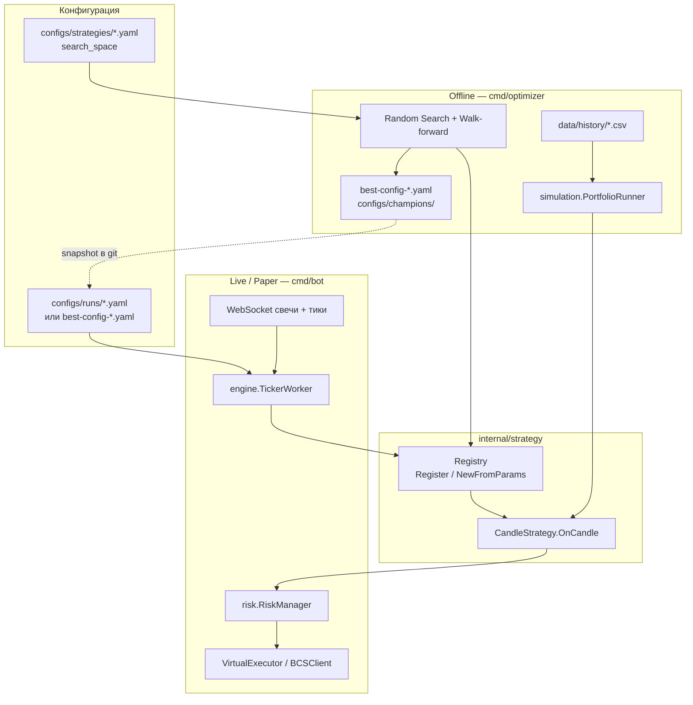

# Стратегии торгового робота

Документ описывает архитектуру торговых стратегий, процесс добавления новой и подключение в **боте** (live/paper) и **optimizer** (offline backtest).

**См. также:**
- [strategy-research.md](strategy-research.md) — FROZEN portfolio, champions, методология исследований
- [champion-orc.md](champion-orc.md), [champion-or-fade.md](champion-or-fade.md), [champion-mf-afternoon.md](champion-mf-afternoon.md) — параметры production-стратегий
- [README](../README.md), [cmd/optimizer/README.md](../cmd/optimizer/README.md)

---

## Содержание

- [Как устроено](#как-устроено)
- [Встроенные стратегии](#встроенные-стратегии)
- [Как завести новую стратегию](#как-завести-новую-стратегию)
- [Подключение в боте](#подключение-в-боте)
- [Подключение в optimizer](#подключение-в-optimizer)
- [Соглашения и частые ошибки](#соглашения-и-частые-ошибки)

---

## Как устроено

### Контракт стратегии

Все стратегии реализуют один интерфейс:

```go
type CandleStrategy interface {
    ID() string
    OnCandle(candle models.Candle) *models.Order
}
```

- **`OnCandle`** вызывается на каждой **закрытой** M5-свече (или другом `candle_timeframe` из конфига).
- Возвращает `*models.Order` с направлением (`BUY`/`SELL`), ценой входа, SL и TP — или `nil`, если сигнала нет.
- Стратегия **не** считает размер позиции и **не** исполняет ордера — это делает `TickerWorker` + `RiskManager`.

Стоп и тейк считаются внутри стратегии через общие хелперы (`calcStopTP`, `stopDistance` в `internal/strategy/common.go`) по режиму `stop_mode`:

| `stop_mode` | Как считается дистанция до SL |
|---|---|
| `range` | Половина диапазона lookback-окна (с опциональным cap 0.5% от цены) |
| `atr` | ATR(period) × `atr_multiplier` |

R:R задаётся полем `reward_ratio` (или дефолтом по типу стратегии — см. `DefaultRewardRatio`).

### Реестр стратегий

Каждая стратегия регистрируется в `init()` через `strategy.Register(Descriptor{...})`:

```go
type Descriptor struct {
    ID                   string
    DefaultSearchSpace   string   // путь к YAML для optimizer
    NewFromParams          func(params Params, ctx BuildContext) (CandleStrategy, error)
    ParamsToConfigFields   func(params Params, ctx BuildContext) map[string]interface{}
}
```

| Функция | Назначение |
|---|---|
| `NewFromParams` | Сборка стратегии из гиперпараметров optimizer (camelCase keys) |
| `ParamsToConfigFields` | Обратное преобразование лучшего trial → поля YAML-конфига бота (snake_case) |
| `DefaultSearchSpace` | Путь к `configs/strategies/<name>.yaml` с секцией `search_space` |

Единая точка создания — `strategy.NewFromParams(id, params, ctx)`. Для бота используется обёртка `config.StrategyConfig.BuildStrategy(session)`.

### Поток данных: бот vs optimizer



**Важно:** optimizer и бот используют **один и тот же код стратегий**. Симулятор (`internal/simulation`) повторяет торговый цикл `TickerWorker`: те же стратегии, риск, трейлинг, EOD.

### Что делает воркер вокруг стратегии

`internal/engine/worker.go`:

1. На старте: `exp.Strategy.BuildStrategy(sessionCfg)` → `CandleStrategy`.
2. На каждой свече: `signal := strategy.OnCandle(candle)`.
3. Если сигнал есть — `RiskManager` проверяет Circuit Breaker, считает лот, воркер открывает **лимитный** ордер.
4. На каждом **тике** котировки — мониторинг SL/TP, трейлинг, EOD-закрытие.

Параметры сессии (`session_open_time`, `entry_delay_minutes`) и лимит входов (`max_trades_per_ticker_per_day`) обрабатываются **вне** стратегии — в воркере и `SessionClock`. Часть стратегий (ORB, momentum_filtered) имеет **собственные** задержки входа — см. `strategy_entry_delay_minutes`.

### Общие утилиты

| Файл | Содержимое |
|---|---|
| `common.go` | Буфер свечей, range/ATR/SMA, volume filter, расчёт SL/TP |
| `params.go` | `Params map[string]float64` для optimizer |
| `options.go` | Legacy `Options` (старые тесты momentum) |
| `strategy.go` | ID-константы, `DefaultType`, `DefaultRewardRatio` |

---

## Встроенные стратегии

| ID (`strategy.type`) | Файл | Идея | Дефолт R:R | Статус |
|---|---|---|---|---|
| `opening_range_continuation` | `opening_range_continuation.go` | ORB + вход на ретесте лимитом; whitelist в коде | 2.6 | **FROZEN champion** (ORC) |
| `opening_range_fade` | `opening_range_fade.go` | Ложный пробой OR → fade; whitelist в коде | 1.5 | **FROZEN champion** (OR Fade) |
| `momentum_filtered` | `momentum_filtered.go` | Momentum + SMA-тренд, long-only, volume filter | 2.0 | **FROZEN champion** (MF Afternoon) |
| `momentum_breakout` | `momentum.go` | Пробой high/low за `lookback` баров | 3.0 | исследования закрыты |
| `opening_range` | `opening_range.go` | ORB: market-пробой диапазона первых `orb_minutes` | 2.0 | отклонено (хуже ORC) |
| `mean_reversion` | `mean_reversion.go` | Fade от SMA при отклонении > `fade_threshold` | 1.5 | отклонено |

Search space по умолчанию — в `configs/strategies/` (см. `DefaultSearchSpace` в каждом `init()`).

### Production portfolio (paper)

Три champion-стратегии в одном процессе:

```bash
go run ./cmd/bot -config configs/runs/portfolio-paper.yaml
```

Snapshot параметров: `configs/champions/*.yaml` (source of truth в git).

| Эксперимент | `strategy.type` | Слот MSK | Тикеры |
|---|---|---|---|
| ORC | `opening_range_continuation` | ~10:00–10:30 | MGNT, ROSN, TATN |
| OR Fade | `opening_range_fade` | ~10:15–12:30 | LKOH, CHMF, MOEX |
| MF Afternoon | `momentum_filtered` | 12:30–18:40 | MGNT, TATN |

Подробнее: [strategy-research.md](strategy-research.md).

Список зарегистрированных ID в рантайме:

```bash
go test ./internal/strategy/ -run TestRegistryListsAllStrategies -v
# или из кода: strategy.ListIDs()
```

---

## Как завести новую стратегию

Ниже — минимальный чеклист. За образец возьмите стратегию, ближайшую по логике (например, `mean_reversion.go` для контртренда, `momentum.go` для пробоя).

### Шаг 1. Константа ID

В `internal/strategy/strategy.go`:

```go
const IDMyStrategy = "my_strategy"
```

Добавьте дефолтный `reward_ratio` в `DefaultRewardRatio`, если нужен особый R:R.

### Шаг 2. Реализация

Создайте `internal/strategy/my_strategy.go`:

```go
func init() {
    Register(Descriptor{
        ID:                 IDMyStrategy,
        DefaultSearchSpace: "configs/strategies/my-strategy.yaml",
        NewFromParams:      newMyStrategyFromParams,
        ParamsToConfigFields: myStrategyConfigFields,
    })
}

type MyStrategy struct {
    mu     sync.Mutex
    opts   myStrategyOpts
    buffer *candleBuffer
    // + session state, если нужен ORB-подобный сброс по дням
}

func (s *MyStrategy) ID() string { return IDMyStrategy }

func (s *MyStrategy) OnCandle(c candle models.Candle) *models.Order {
    s.mu.Lock()
    defer s.mu.Unlock()
    // 1. buffer.push / проверка lookback
    // 2. логика сигнала
    // 3. calcStopTP / buildOrder
    // 4. return order или nil
}
```

Обязательные функции:

- `newMyStrategyFromParams(params Params, ctx BuildContext)` — читает camelCase-ключи из optimizer.
- `myStrategyConfigFields(params, ctx)` — возвращает `map[string]interface{}` с **snake_case** ключами для YAML бота.

Имена параметров в optimizer (camelCase) ↔ YAML бота (snake_case) маппятся в `internal/config/strategy_factory.go` → `toStrategyParams` и в `StrategyConfigFromMap`.

### Шаг 3. Поля конфига

Если стратегии нужны **новые** YAML-поля:

1. Добавьте поля в `StrategyConfig` (`internal/config/config.go`).
2. Прокиньте их в `toStrategyParams` (`internal/config/strategy_factory.go`).
3. Добавьте разбор в `StrategyConfigFromMap` (для `best-config` из optimizer).
4. При необходимости — в `buildBestConfig` / `strategyYAML` (`internal/optimizer/report/report.go`).

Существующие поля, которые уже есть в `StrategyConfig`:

`lookback`, `stop_mode`, `atr_period`, `atr_multiplier`, `reward_ratio`, `range_use_cap`, `volume_filter`, `volume_min_ratio`, `breakout_threshold`, `max_trades_per_ticker_per_day`, `long_only`, `trend_sma_period`, `strategy_entry_delay_minutes`, `orb_minutes`, `fade_threshold`, параметры OR Fade (`fade_window_minutes`, `fade_trade_end_minutes`, `require_inside_range`), а также трейлинг (`trail_*`).

### Шаг 4. YAML search space

Создайте `configs/strategies/my-strategy.yaml` по образцу `momentum-breakout.yaml`:

```yaml
strategy:
  type: my_strategy
  stop_mode: atr
  # ... дефолтные значения для backtest

search_space:
  strategy: my_strategy
  parameters:
    lookback:
      type: int
      min: 10
      max: 40
    myParam:
      type: float
      min: 0.01
      max: 0.10
  fixed:
    riskPerTradePercent: 0.5
    dailyLossLimitPercent: 2.0
```

Ключи в `parameters` — **camelCase** (как в `Params` optimizer). Секция `fixed` не участвует в random search.

### Шаг 5. Тесты

Добавьте unit-тест в `internal/strategy/`:

```go
func TestMyStrategySignal(t *testing.T) {
    s, err := NewFromParams(IDMyStrategy, Params{
        "lookback": 5, "rewardRatio": 2,
    }, BuildContext{StopMode: StopModeRange})
    // прогоните синтетические свечи, проверьте сигнал
}
```

Обновите `TestRegistryListsAllStrategies`, если считаете стратегии по числу.

### Шаг 6. (Опционально) strategy-matrix

Добавьте строку в `scripts/run-strategy-matrix.sh`, если стратегию нужно сравнивать с остальными в batch-прогоне.

---

## Подключение в боте

### Один эксперимент (без секции `experiments`)

```yaml
# configs/runs/my-run.yaml
trading_mode: virtual

tickers: [SBER, GAZP]
class_code: TQBR
candle_timeframe: M5

strategy:
  type: mean_reversion          # ← ID из registry
  stop_mode: atr
  lookback: 15
  fade_threshold: 0.015
  atr_multiplier: 2.0
  reward_ratio: 1.5
  max_trades_per_ticker_per_day: 3

risk:
  deposit: 200000
  max_daily_loss_percent: 2.0
  risk_per_trade_percent: 0.5

virtual:
  balance: 200000

session:
  timezone: Europe/Moscow
  session_open_time: "10:00"
  eod_close_time: "18:40"
```

Если `type` не указан — используется `momentum_breakout` (`DefaultType()`).

### Несколько A/B-экспериментов

При секции `experiments[]` корневые `strategy` / `risk` / `virtual` **игнорируются**. Каждый эксперимент задаёт свой `strategy.type`:

```yaml
experiments:
  - id: mr-atr
    tickers: [SBER, MGNT]
    strategy:
      type: mean_reversion
      stop_mode: atr
      lookback: 12
      fade_threshold: 0.02
    risk:
      deposit: 200000
      risk_per_trade_percent: 0.5
    virtual:
      balance: 200000

  - id: orb-range
    strategy:
      type: opening_range
      stop_mode: range
      orb_minutes: 30
      breakout_threshold: 0.005
```

Запуск:

```bash
export BCS_REFRESH_TOKEN=...
go run ./cmd/bot -config configs/runs/portfolio-paper.yaml   # production champions
# go run ./cmd/bot -config configs/runs/experiments-all.yaml  # legacy A/B momentum
```

### Из champion snapshot или best-config optimizer

Готовые параметры — в `configs/champions/`:

```bash
go run ./cmd/bot -config configs/champions/orc-wave2.yaml
```

После нового прогона optimizer:

```bash
cp results/or-fade/wave1-conservative/best-config-*.yaml configs/champions/or-fade-wave1-conservative.yaml
# проверьте tickers, session, virtual.balance
go run ./cmd/bot -config configs/champions/or-fade-wave1-conservative.yaml
```

Auto-deploy **не** предусмотрен — конфиг применяется вручную, champion snapshot коммитится в git.

### Валидация при загрузке

`config.Validate()` вызывает `ValidateStrategyType(type)` — неизвестный `type` приведёт к ошибке старта.

---

## Подключение в optimizer

### Быстрый запуск одной стратегии

```bash
make build-optimizer
make sync-history   # нужен BCS_REFRESH_TOKEN

bin/optimizer run \
  -strategy mean_reversion \
  -search-space configs/strategies/mean-reversion.yaml \
  -stop-mode atr \
  -trials 200 \
  -output results/exp-mean_reversion/
```

Флаг `-search-space` можно опустить — тогда берётся `DefaultSearchSpace` из registry:

```bash
bin/optimizer run -strategy opening_range -stop-mode atr -output results/exp-opening_range/
```

### Основные флаги

| Флаг | Описание |
|---|---|
| `-strategy` | ID стратегии (`strategy.ListIDs()`) |
| `-search-space` | YAML с секцией `search_space` (default — из registry) |
| `-stop-mode` | `atr` или `range` — **вне** search space, отдельный прогон |
| `-tickers` / `-tickers-config` | Universe тикеров |
| `-trials` | Число random search trials |
| `-output` | Каталог для JSON, `best-config-*.yaml`, charts, export |

### Что происходит внутри

1. Загружается `search_space` из YAML; проверяется `search_space.strategy == -strategy`.
2. Random Search генерирует `ParameterSet` (camelCase).
3. Для каждого trial: `strategy.NewFromParams(id, params, BuildContext{StopMode, Session})`.
4. `simulation.PortfolioRunner` прогоняет walk-forward окна по CSV-истории.
5. Лучший trial → `best-config-*.yaml` через `ParamsToConfigFields` + `StrategyConfigFromOptimizer`.

### Backtest без оптимизации

```bash
bin/optimizer backtest \
  -strategy momentum_breakout \
  -search-space configs/strategies/momentum-breakout.yaml \
  -from 2025-01-01 -to 2025-06-01
```

### Сравнение нескольких стратегий

```bash
make strategy-matrix
# или вручную — scripts/run-strategy-matrix.sh
```

Скрипт последовательно запускает optimizer для каждой стратегии и пишет сводку в `results/strategy-matrix-summary.json`.

### Добавление новой стратегии в optimizer

Достаточно выполнить [шаги 1–4](#как-завести-новую-стратегию) — отдельной регистрации в `cmd/optimizer` нет. Optimizer импортирует `_ "bcs-trading-bot/internal/strategy"` (через eval/simulation) и видит все `init()`-регистрации.

Проверка:

```bash
bin/optimizer run -strategy my_strategy -trials 1 -output /tmp/test-my-strategy/
```

---

## Соглашения и частые ошибки

### Именование параметров

| Слой | Стиль | Пример |
|---|---|---|
| Optimizer `Params` / `search_space.parameters` | camelCase | `breakoutThreshold`, `maxEntriesPerTickerPerDay` |
| YAML бота `strategy.*` | snake_case | `breakout_threshold`, `max_trades_per_ticker_per_day` |
| CLI optimizer | snake_case в флагах, kebab-case | `-stop-mode`, `-min-trades` |

Маппинг optimizer → config: `ParamsToConfigFields` + `StrategyConfigFromOptimizer`.

### Bool-параметры в optimizer

В `Params` bool кодируется как `0.0` / `1.0` (`params.Bool()` — порог 0.5). Для `volumeFilter` часто используют наличие ключа `volumeFilterMultiplier` как implicit enable.

### `stop_mode` и `type` — разные оси

- **`type`** — логика входа (momentum, ORB, mean reversion…).
- **`stop_mode`** — способ расчёта SL (atr/range).

Оба задаются отдельно. В optimizer `stop_mode` — флаг CLI, не параметр random search.

### Дублирование задержки входа

- `session.entry_delay_minutes` — блокирует **все** входы в воркере до N минут после открытия сессии.
- `strategy.strategy_entry_delay_minutes` — задержка **внутри** стратегии (например, у `momentum_filtered`).

Не путайте их при настройке.

### ORC, OR Fade и whitelist тикеров

В коде заданы **per-strategy whitelist/blacklist** (`internal/strategy/common.go` → `tickerAllowed`):

| Стратегия | Whitelist (код) | Blacklist | Champion-тикеры (paper) |
|---|---|---|---|
| `opening_range_continuation` | MGNT, ROSN, TATN | SBER, GAZP, LKOH, … | MGNT, ROSN, TATN |
| `opening_range_fade` | LKOH, CHMF, TATN, GAZP, MOEX | SBER, NVTK, ROSN, MGNT | LKOH, CHMF, MOEX |

Optimizer может прогонять широкий universe, но сигналы генерируются только на тикерах из whitelist.  
В `experiments[].tickers` задаётся фактический набор инструментов для счёта — он может быть **уже** whitelist (как у OR Fade conservative).

### OR Fade — параметры слота

Помимо `orb_minutes` и `breakout_threshold`:

| YAML (`strategy.*`) | Optimizer (`Params`) | Смысл |
|---|---|---|
| `fade_window_minutes` | `fadeWindowMinutes` | Окно ожидания возврата в диапазон после пробоя |
| `fade_trade_end_minutes` | `fadeTradeEndMinutes` | Конец торговли fade от open (минуты) |
| `require_inside_range` | `requireInsideRange` | Вход только если close вернулся внутрь OR |

Если не заданы — дефолты в коде: 30 / 90 / `true`.

### Трейлинг

Параметры `trail_activation_r`, `trail_discrete_step_r`, `trail_stage_max` — в YAML `strategy`, обрабатываются воркером (`TrailingConfig`), не в `OnCandle`.

### Чеклист перед merge

- [ ] `init()` + уникальный `ID`
- [ ] `NewFromParams` + `ParamsToConfigFields`
- [ ] `configs/strategies/<name>.yaml` с `search_space.strategy`
- [ ] Unit-тест на синтетических свечах
- [ ] `go test ./internal/strategy/...`
- [ ] Smoke: `optimizer run -trials 5` + `go run ./cmd/bot -smoke-test` с новым type
